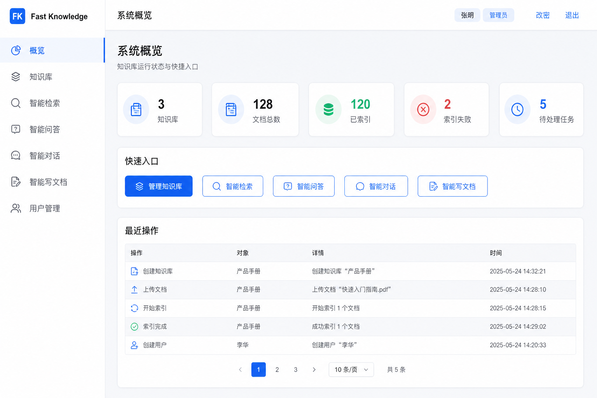
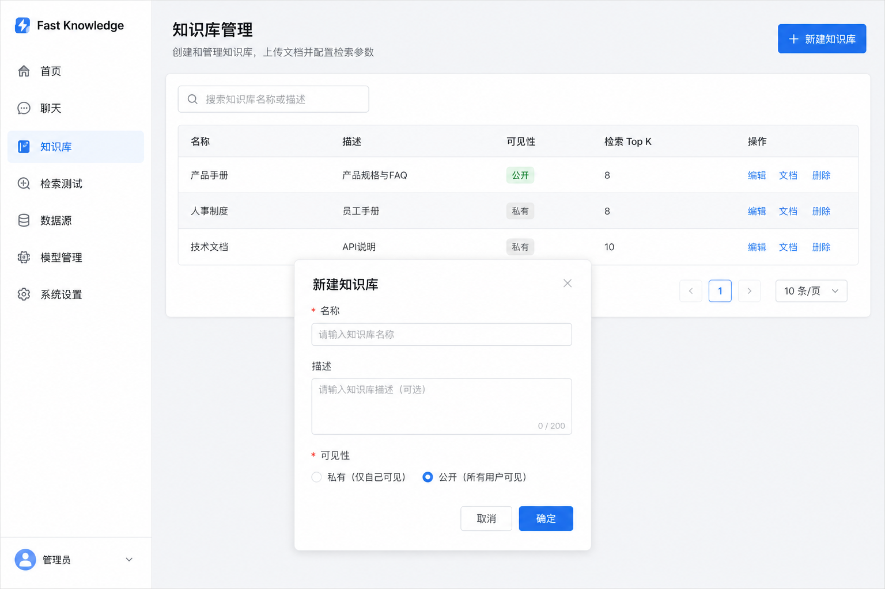
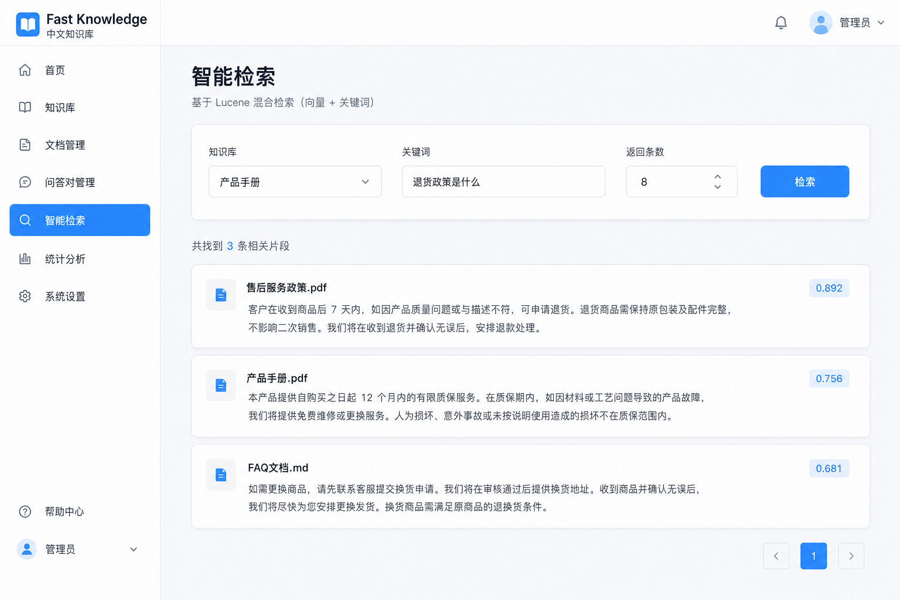
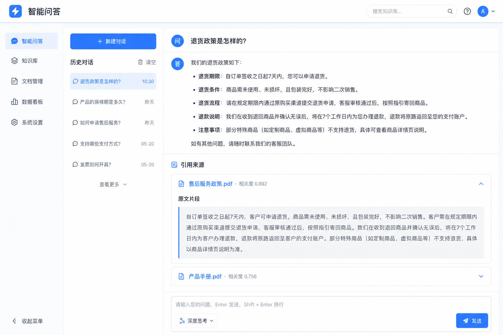
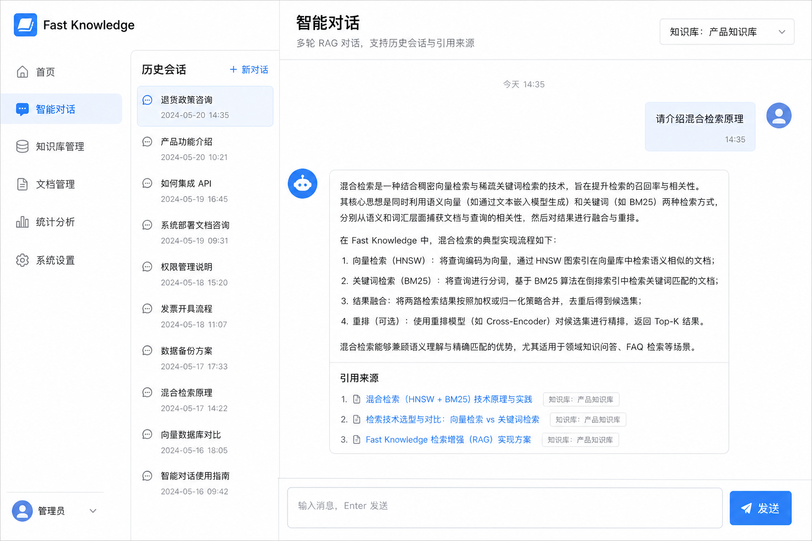
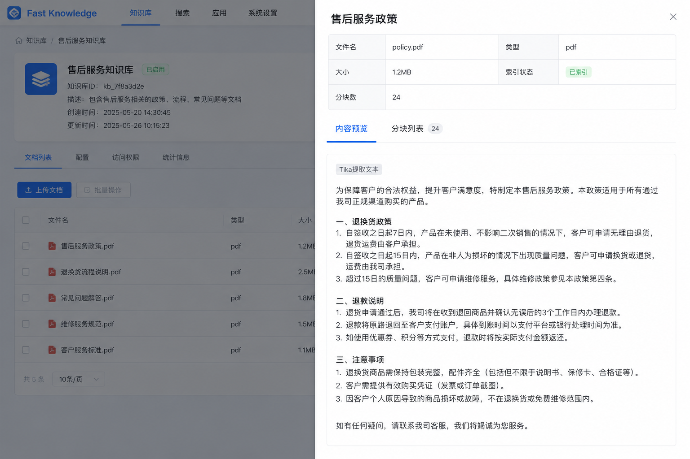
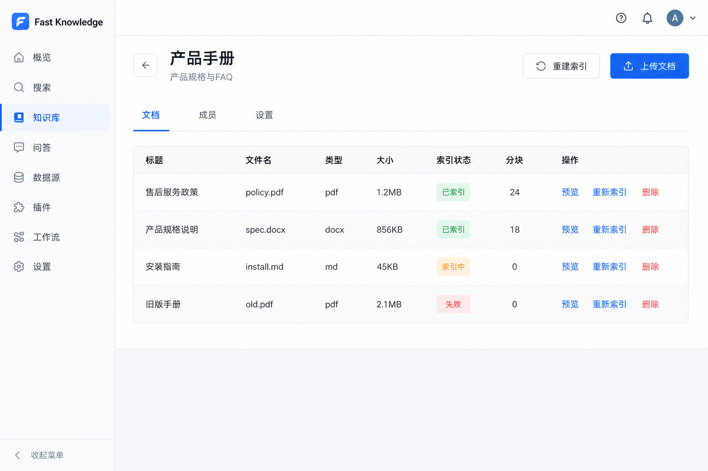

# Fast Knowledge

**面向中小企业的 Java 私有化知识库** — 把制度、工艺、设备文档变成可检索、可问答、可审计的企业知识资产。

**Fast = 部署快（Docker 5 分钟）+ 检索快（双层缓存 <50ms）+ 交付快（离线圈 + 审计验收）。**

[](https://github.com/lixuanqun/fast-knowledge/actions/workflows/ci.yml)
[](LICENSE)
[](apps/server/)
[](apps/server/)
[](web/)

[产品说明](docs/产品说明.md) · [v1.0.0 功能范围](docs/releases/v1.0.0.md) · [**自动化测试报告**](docs/testing/automation-report.md) · [快速部署](docs/deployment/docker.md) · [API](docs/api.md)

---

## 一句话

在你自己的服务器上，部署一套**数据不出域**的知识库 + 智能检索 + RAG 问答系统。  
用 **Java / Spring Boot** 技术栈交付，用 **审计与离线包** 验收，**不做**通用 Agent 工作流平台。

---

## 你能用它做什么

| 场景 | 能做什么 |
|------|----------|
| **制度 / 红头文件** | 按文号、类型检索；问答附引用来源，一键跳转原文定位 |
| **工艺 / SOP / 设备手册** | 上传 PDF/Word，混合检索找段落，多轮对话追问细节 |
| **系统集成** | REST API + 服务账号 API Key，对接 OA、MES、门户 |

---

## 核心特性

### 知识库与 AI

- **混合检索** — 向量 + 全文（pgvector HNSW 索引），可选本地 ONNX Rerank
- **双层缓存** — Caffeine L1 本地 + Redis L2，热查询 <1ms
- **RAG 问答** — 单次问答、多轮流式对话（含 Query Rewrite 指代消解）、AI 写文档，均附引用来源
- **多格式文档** — PDF / DOCX / TXT / MD / PPTX / XLSX / HTML，异步索引与分块预览
- **LLM 中立** — Ollama、DeepSeek、智谱、百炼等 OpenAI 兼容接口，管理界面配置即生效
- **本地 Embedding** — 默认 ONNX `bge-small-zh-v1.5`，启动预热，可纯内网运行

### 制造 / 国企场景（v1.0.0）

- **文档元数据** — 类型（制度/工艺/设备…）、文号、生效日期、部门、标签
- **引用溯源** — 检索与问答返回章节信息，点击可预览并高亮对应分块
- **Wiki 基础层** — 文档索引后自动编译 Markdown 知识页（浏览，审核流完善中）

### 企业交付与安全

- **LDAP + OIDC** — 对接企业统一身份，保留本地管理员兜底
- **全链路审计** — 登录、检索、问答、对话可查可导出 CSV
- **不出域模式** — `LLM_ALLOW_EXTERNAL=false` 禁止外连大模型与云端 Rerank
- **离线交付包** — 气隙/内网环境镜像与安装脚本
- **API Key** — 服务账号调用，适合后端系统集成
- **备份恢复** — PostgreSQL + MinIO 一键备份脚本与 Runbook

### 部署方式

```bash
./scripts/install.sh          # Linux/macOS 一键 Docker 全栈
# .\scripts\install.ps1       # Windows
```

访问 http://localhost:8088 · 默认账号 `admin` / `admin123`

也支持：单 Jar（`-Pbundle`）· K8s 清单 · [离线安装](docs/deployment/offline-install.md) · [企业配置](apps/server/src/main/resources/application-enterprise.yml)

---

## 适合谁 / 不适合谁

| 适合 | 不适合 |
|------|--------|
| 国企、金融、制造等需**私有化部署**的组织 | 多租户 SaaS 运营平台 |
| 万级文档、数百用户的部门/企业知识库 | 十万级文档、千人并发搜索中台 |
| 技术栈以 **Java** 为主、需 REST 集成的团队 | 要可视化工作流 / MCP / 多模态 Agent 平台 |
| 合同要写清「**数据不出域、行为可审计**」的项目 | 不愿自建任何 AI 组件且不接受 ONNX/Ollama |

---

## 竞品对比

四个主流的开源知识库产品，定位与应用场景各有侧重：

| | Fast Knowledge | WeKnora | MaxKB | RAGFlow |
|--|---------------|---------|-------|---------|
| **定位** | 中小企业私有化知识库 | 企业级 RAG + Agent + Wiki 平台 | 低代码知识库问答系统 | 深度文档理解 RAG 引擎 |
| **技术栈** | **Java 21 + Spring Boot** | Go + Gin | Python + Django | Python |
| **AI 框架** | LangChain4j | 自研 Pipeline | LangChain | 自研 DeepDoc |
| **向量库** | pgvector | 8 种可插拔 | pgvector / FAISS / Milvus | ES + Infinity |
| **许可协议** | **MIT** | MIT | GPL-3.0 | Apache 2.0 |
| **部署形态** | **单实例·每企一套** | 多租户 SaaS | 单机到集群 | 容器化私有部署 |
| **Agent / 工作流** | ❌ 不做通用 Agent | ✅ ReAct + MCP | ✅ DAG 工作流编排 | ✅ 多 Agent 协作 |
| **多模态** | ❌ | 图片 OCR | 图片/音视频 | ✅ 深度文档理解 |
| **知识图谱** | ❌ | ✅ GraphRAG | 部分支持 | ✅ GraphRAG |
| **IM 渠道** | REST API 集成 | 企微/飞书/钉钉等 7 种 | 基础集成 | 飞书/Discord/Telegram |
| **合规特色** | **审计导出 + 不出域 + 离线包** | RBAC 多租户 | 国密加密 | 基础权限 |
| **交付受众** | Java 栈·国企·制造·合同验收 | Python/Go 栈·通用企业 | Python 栈·低代码用户 | Python 栈·文档密集型 |

### 为什么选 Fast Knowledge

| 你的情况 | 推荐理由 |
|----------|----------|
| 团队是 **Java/Spring Boot** 技术栈 | 唯一 Java 知识库产品，无需引入 Python/Go 运维负担 |
| 客户要求 **数据不出域、行为可审计** | 纯内网模式 + 全链路审计 CSV 导出 + 离线交付包，直接满足合规验收 |
| 面向 **国企/制造业/合同交付** | 文号、文档类型、章节引用溯源——内置制造场景字段，不需二次开发 |
| 要 **REST API 集成** 到 OA/MES/门户 | API Key + 标准 REST 接口，不是 iframe 嵌入 |
| 不需要 Agent 工作流 | 不做通用 Agent 平台，降低复杂度与交付风险 |

### 什么时候选其他产品

| 你的需求 | 推荐产品 |
|----------|----------|
| 要可视化编排 Agent + MCP 工具 + 多模态 | [WeKnora](https://github.com/Tencent/WeKnora) — Go 技术栈，功能最全 |
| 要低代码拖拽 + 工作流 + 快速 Demo | [MaxKB](https://github.com/1Panel-dev/MaxKB) — Python 技术栈，开箱即用 |
| 要极致文档解析 + GraphRAG + 深度检索 | [RAGFlow](https://github.com/infiniflow/ragflow) — Python 技术栈，文档理解最强 |

---

## 界面预览

高保真 UI 设计稿（1440×900 桌面端）。完整浅色 / 暗色共 52 张见 **[设计稿目录](docs/design/README.md)**。

<table>
  <tr>
    <td align="center" width="50%">
      
      <br /><sub><b>系统概览</b> — 知识库与索引状态一览</sub>
    </td>
    <td align="center" width="50%">
      
      <br /><sub><b>知识库管理</b> — 创建、权限与文档入口</sub>
    </td>
  </tr>
  <tr>
    <td align="center">
      
      <br /><sub><b>智能检索</b> — 混合检索，按类型筛选</sub>
    </td>
    <td align="center">
      
      <br /><sub><b>智能问答</b> — RAG 回答 + 引用来源展开</sub>
    </td>
  </tr>
  <tr>
    <td align="center">
      
      <br /><sub><b>智能对话</b> — 多轮 RAG，历史会话</sub>
    </td>
    <td align="center">
      
      <br /><sub><b>文档预览</b> — 分块列表与引用定位</sub>
    </td>
  </tr>
</table>

<p align="center">
  
  <br /><sub><b>知识库详情</b> — 文档元数据、上传、索引与 Wiki</sub>
</p>

<p align="center">
  <sub>亦支持暗色主题 · 示例见 <a href="docs/design/dark-02-dashboard.png">暗色概览</a> · <a href="docs/design/dark-05-qa.png">暗色问答</a></sub>
</p>

**功能入口**：知识库 · 智能检索 · 智能问答 · 多轮对话 · AI 写文档  
**管理员**：用户管理 · 审计日志 · API Key · 大模型配置

```
概览 → 知识库 → 上传文档 → 检索 / 问答 / 对话
                              ↓
                        引用来源 → 跳转原文高亮
```

---

## 技术架构（简图）

```
Vue 3 管理端
    ↓
Spring Boot API（JWT / LDAP / OIDC / API Key）
    ↓
PostgreSQL + pgvector · Redis · MinIO
    ↓
LangChain4j — 摄入 / HYBRID 检索 / RAG / 对话 / Rerank
    ↓
LLM（OpenAI 兼容，可纯内网 Ollama）
```

**技术栈**：Java 21 · Spring Boot 3.5 · LangChain4j · Vue 3 · PostgreSQL · Redis · MinIO

本地开发：`.\scripts\dev.ps1`（后端 `:8088/api`，前端 `:5174`）

---

## 文档

| 我想… | 去看 |
|-------|------|
| 了解完整功能清单 | [产品说明](docs/产品说明.md) |
| 看 v1.0.0 已交付什么 | [docs/releases/v1.0.0.md](docs/releases/v1.0.0.md) |
| **查看自动化测试报告** | [**docs/testing/automation-report.md**](docs/testing/automation-report.md) |
| 部署与运维 | [Docker](docs/deployment/docker.md) · [备份恢复](docs/deployment/backup-restore.md) · [K8s](k8s/README.md) |
| 对接 API | [docs/api.md](docs/api.md) |
| 数据不出域验收 | [合规清单](docs/compliance/data-residency-checklist.md) |

---

## 仓库结构

```
apps/server/   后端（Spring Boot + LangChain4j）
web/           前端（Vue 3）
docker/        Docker Compose
scripts/       安装、开发、备份、离线交付
docs/          产品、架构、部署、合规
```

---

## 许可证

本项目采用 **[MIT License](LICENSE)** 开源，可自由用于个人、学术及商业场景（保留版权声明即可）。

---

<p align="center">
  <sub>生产稳定基线 <code>main</code> @ <strong>v1.0.0</strong> · 自动化测试见 <a href="docs/testing/automation-report.md">测试报告</a> · 规划中的 v2.0.0 见 <a href="docs/releases/v2.0.0.md">发布说明</a></sub>
</p>
